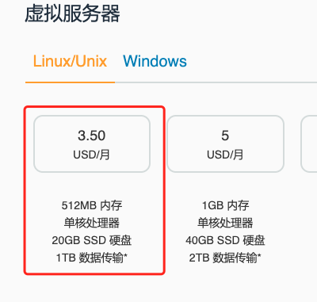
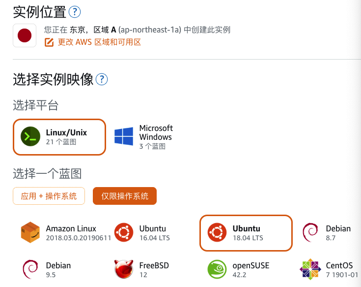
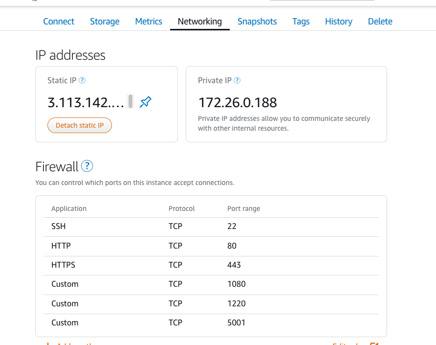

# Freedom3w

自由冲浪(番羽土啬)指北

## 零.序

本文主要介绍自己禾斗学上网的环境搭建

番羽土啬的目的主要是为了学习、工作、交友、查资料、和丰富自己的眼界，不是为了(此处省略2万字)


## 壹.依赖
1. English
2. AWS，VPS
3. 网络知识
4. linux
5. docker
   

## 贰.服务端

### 2.1 购买aws的vps

https://aws.amazon.com/cn/lightsail/

* 选择好最便宜的配置
  


* 选择好地理位置，平台，操作系统。



### 2.2 配置防火墙开放端口


### 2.3 安装服务器基础应用

```
# docker
sudo apt-get install docker-io

# docker-compose
sudo curl -L "https://github.com/docker/compose/releases/download/1.24.1/docker-compose-$(uname -s)-$(uname -m)" -o /usr/local/bin/docker-compose

sudo chmod +x /usr/local/bin/docker-compose
```

### 2.4 配置shadowsocks

```
# 建一个目录
mkdir docker

cd docker/

# 配置
vim docker-compose.yml

```

文件里写入
```
version: '3'
services:
  shadowsocks:
    image: shadowsocks/shadowsocks-libev
    ports:
      - "1080:8388/tcp"
      - "1080:8388/udp"
    environment:
      - METHOD=rc4-md5
      - PASSWORD=password
    restart: always
```

### 2.5 启动

```
docker-compose up -d
```

## 叁.客户端

### 3.1桌面端
* mac端
